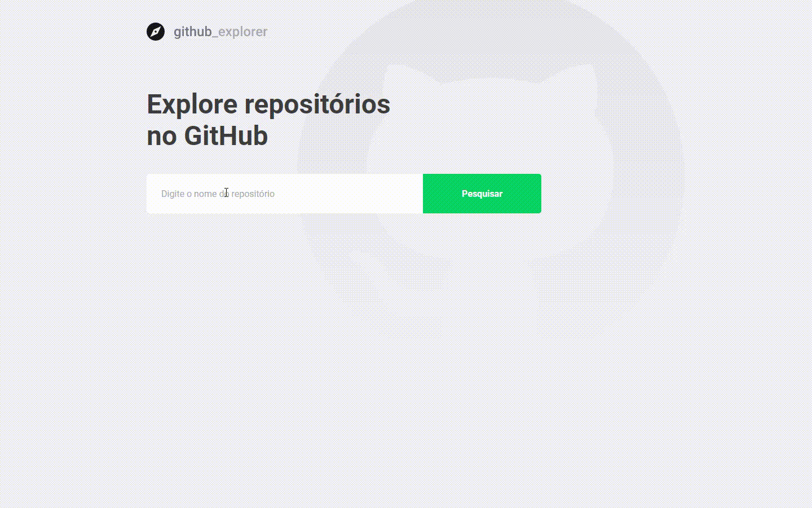

 <div align="center" id="top"> 
  <a href="https://github.com/Adriano-Santtos/github-explorer"> Inglês </a>
  - <a> Português </a>
</div>
&#xa0;

<div align="center" id="top"> 
  

  &#xa0;

</div>

<h1 align="center">Github Explorer</h1>

<!-- < align="center">
  

  

  

  

  <!--  -->

  <!--  -->

  <!--  -->


<!-- Status -->

<!-- <h4 align="center"> 
	🚧  Github Explorer 🚀 Under construction...  🚧
</h4> 

<hr> -->
<p align="center">
  <a href="#dart-sobre">Sobre</a> &#xa0; | &#xa0; 
  <a href="#sparkles-próximas-funcionalidades">Próximas Funcionalidades</a> &#xa0; | &#xa0;
  <a href="#rocket-tecnologias">Tecnologias</a> &#xa0; | &#xa0;
  <a href="#white_check_mark-requisitos">Requisitos</a> &#xa0; | &#xa0;
  <a href="#checkered_flag-clone">Clone</a> &#xa0;  
</p>



<br>

  <p align="center">
  <a 
  href="https://github-explorer-asanttos.vercel.app/" ><strong>👉 Demo 👈</strong></a>
  </p>

<br>

## :dart: Sobre ##

O github explorer é um aplicativo front end desenvolvido durante o bootcamp GoStack da Rocketseat.

O aplicativo permite que você pesquise os repositórios existentes no Github e obtenha informações como: Issues, forks e stars.

Para isso, foi utilizada a API do Github.

## :sparkles: Próximas Funcionalidades ##

👉 Autocompletar pesquisa;

👉 Landing Page;

👉 Dark Mode;


## :rocket: Tecnologias ##

As seguintes ferramentas foram usadas nesse projeto:

- [Node.js](https://nodejs.org/en/)
- [React](https://pt-br.reactjs.org/)
- [TypeScript](https://www.typescriptlang.org/)
- [Styled Components](https://styled-components.com/)

## :white_check_mark: Requirements ##

Antes de começar :checkered_flag:, você precisa ter o  [Git](https://git-scm.com) e o [Node](https://nodejs.org/en/) instalados em sua máquina.


## :checkered_flag: Clone ##

```bash
# Clone esse repositório
$ git clone https://github.com/Adriano-Santtos/github-explorer

# Vá até a pasta do projeto
$ cd tomatte

# Instale as dependências
$ yarn

# Execute o projeto
$ yarn start

# O servidor vai iniciar na <http://localhost:3000>
```


Made by <a href="https://github.com/Adriano-Santtos" target="_blank">Adriano Santtos</a>

&#xa0;

<a href="#top">Volte para o topo</a>
# github-explorer
